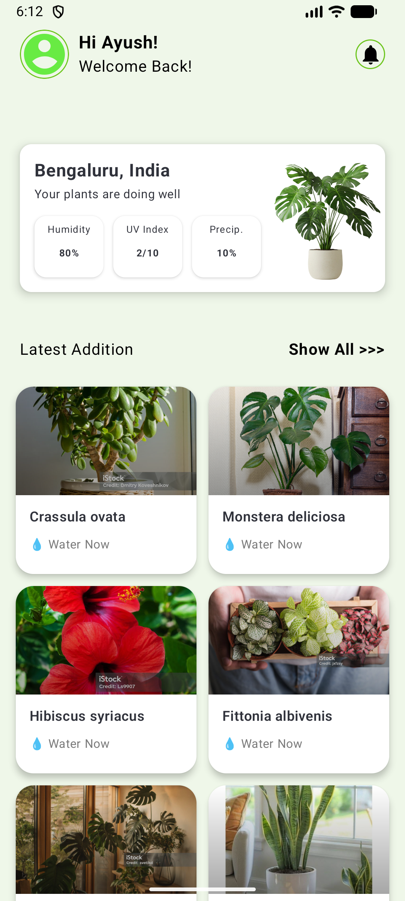
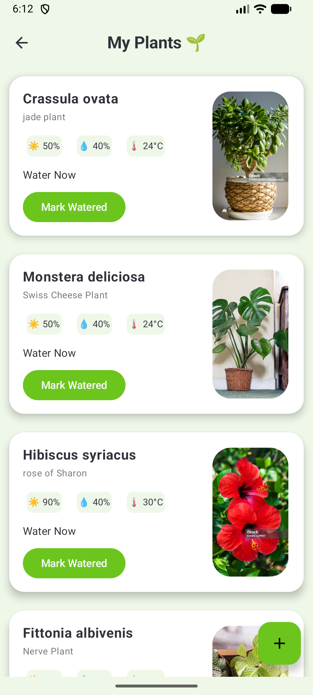
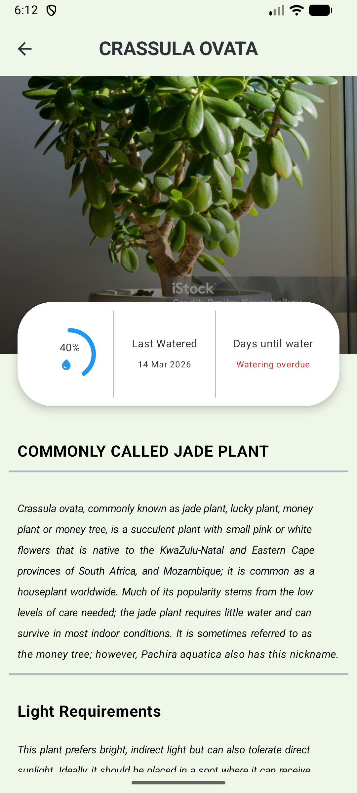
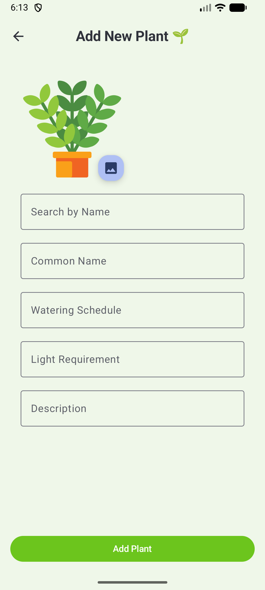

# Plant Health Tracker 🌿

A modern Android application built with Jetpack Compose to help you track and maintain the health of your indoor and outdoor plants.

## Features

- **Dashboard**: Get a quick overview of your "Green Garden" and plant health status.
- **Plant Discovery**: Search for plants using an external API to get accurate care details.
- **Plant Management**: Add plants to your personal collection with custom names and images.
- **Care Tracking**: Monitor watering schedules and light requirements for each plant.
- **Detailed Insights**: View specific care instructions, descriptions, and moisture levels for individual plants.
- **Notifications**: (In development) Get reminded when it's time to water your plants.

## Tech Stack

- **UI**: [Jetpack Compose](https://developer.android.com/jetpack/compose) for a modern, declarative UI.
- **Language**: [Kotlin](https://kotlinlang.org/)
- **Architecture**: MVVM (Model-View-ViewModel)
- **Local Database**: [Room](https://developer.android.com/training/data-storage/room) for persistent storage of your plant collection.
- **Networking**: [Retrofit](https://square.github.io/retrofit/) & [Gson](https://github.com/google/gson) for API communication.
- **Image Loading**: [Coil](https://coil-kt.github.io/coil/) for asynchronous image loading.
- **Navigation**: [Compose Navigation](https://developer.android.com/jetpack/compose/navigation)

## Project Structure

- `ui/screens/dashboard`: Main entry point with plant overview.
- `ui/screens/addplants`: Interface for searching and adding new plants.
- `ui/screens/plantlist`: Your personal collection of plants.
- `ui/screens/plantdetails`: Detailed care information for a specific plant.
- `data/local`: Room database entities and DAOs.
- `data/api`: Retrofit service interfaces and API models.

## Getting Started

1. Clone the repository.
2. Open the project in **Android Studio (Ladybug or newer)**.
3. Add your `PLANT_API_KEY` to `local.properties` or `build.gradle` (if required by the API service).
4. Sync Gradle and run the app on an emulator or physical device.

## Screenshots

  
  
  
  

---
Developed with ❤️ by TheHaloTech.
